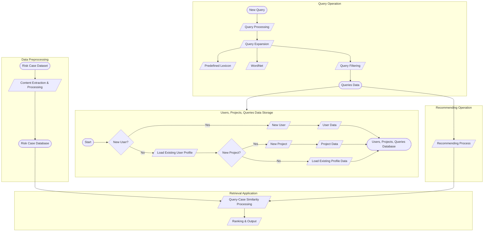

# ACRIS Architecture

```mermaid
flowchart TB

  subgraph DP[Data Preprocessing]
    A1([Risk Case Dataset])
    A2[/Content Extraction & Processing/]
    A3([Risk Case Database])
    A1 --> A2 --> A3
  end

  subgraph UPQ[Users, Projects, Queries Data Storage]
    B1([Start])
    B2{New User?}
    B3[/New User/]
    B4[/User Data/]
    B5[/Load Existing User Profile/]
    B6{New Project?}
    B7[/New Project/]
    B8[/Project Data/]
    B9[/Load Existing Profile Data/]
    B10([Users, Projects, Queries Database])

    B1 --> B2
    B2 -- Yes --> B3 --> B4 --> B10
    B2 -- No --> B5 --> B6
    B6 -- Yes --> B7 --> B8 --> B10
    B6 -- No --> B9 --> B10
  end

  subgraph QO[Query Operation]
    C1([New Query])
    C2[/Query Processing/]
    C3[/Query Expansion/]
    C4[/Predefined Lexicon/]
    C5[/WordNet/]
    C6[/Query Filtering/]
    C7([Queries Data])

    C1 --> C2 --> C3 --> C6 --> C7
    C3 --> C4
    C3 --> C5
  end

  subgraph RO[Recommending Operation]
    D1[/Recommending Process/]
  end

  subgraph RA[Retrieval Application]
    E1[/Query-Case Similarity Processing/]
    E2[/Ranking & Output/]
    E1 --> E2
  end

  A3 --> E1
  C7 --> D1 --> E1
  C7 --> UPQ

```
